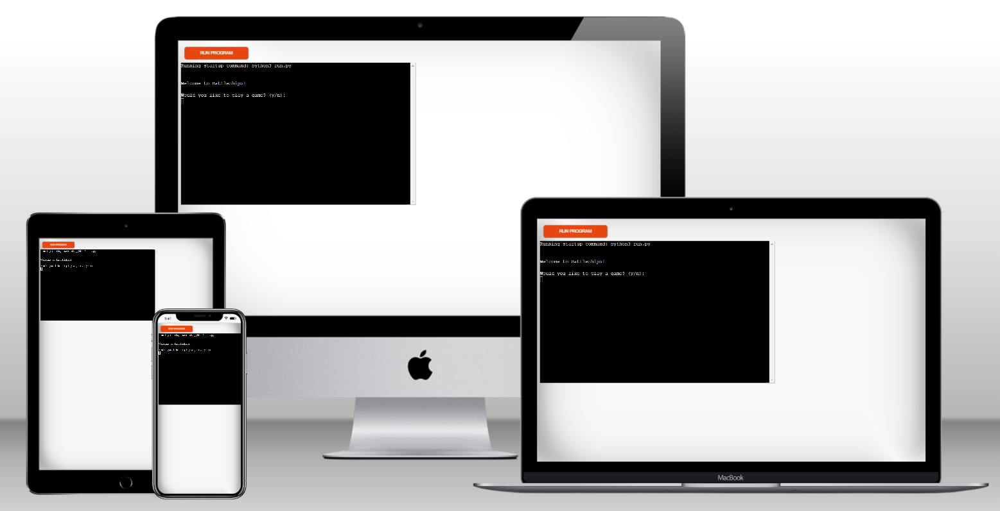
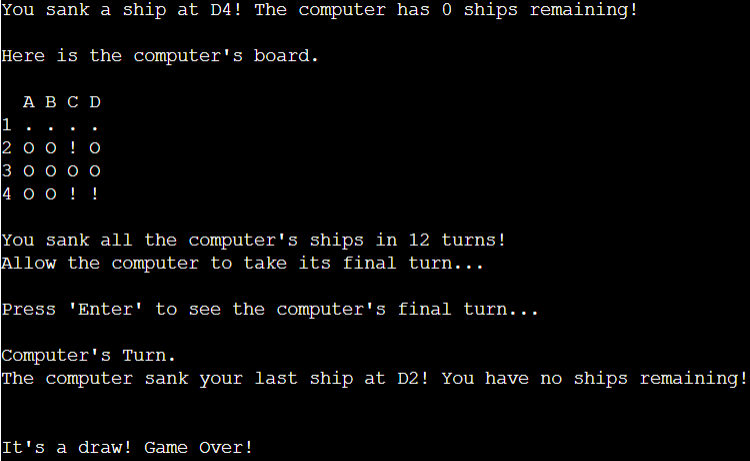
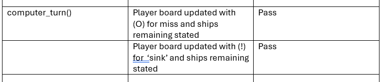

# Battleships
Welcome to Battleships!

This is a Python terminal game, which runs in Code Institute's mock terminal on the Heroku platform.

[Click here to play!](https://battleships-duffew-364e826d24f8.herokuapp.com/)

## Game Rules
Battleships is a turn-based guessing game where a player and the computer compete to sink each other's ships.

The player chooses a board size and two boards are randomly generated. The boards are prepopulated with ships based upon the board size. The player's board shows thier ship's locations. The computer's board has their ships hidden.

The player always plays first and chooses coordinates from the computer's board. If the coordinate houses a ship, the computer's board is marked with '!' and the computer loses one ship. If the coordinate is empty, the board is marked with 'O' to indicate a miss. The computer then plays its turn following the same marking conventions. Turns alternate until a winner is detremined or the game is drawn.

The game has been designed so that even though the player always plays first, the player and computer always have the same number of turns to maintain fairness. This means that if that player sinks all the computer ships first, the computer still has a chance to draw the game.

Win conditions:
+ Player wins if:
    - They sink the computer's last ship AND 
    - The computer fails to sink the player's last ship on its final turn
+ Computer wins if:
    - The computer has ships remaining AND
    - It sinks the player's last ship on its turn
+ The game is drawn if:
    - The player sinks the computer's last ship AND
    - The compueter sinks the player's last ship on its final turn

The game can be quit early by the player on thier turn by selecting Q when prompted to choose a column.

## Features
### Current Features
+ User defined board size
    - The user can choose a board size from between 4 and 8 square
    - Ships are randomly placed on the both the player's and computer's board
    - The number of ships placed is 20% of the total cells on the board
    - The computer's ships are hiden from the player unless sunk
    - The boards feature alphabeticised columns and numeric rows

    

+ Games are played against the computer, and the player always takes the first turn
+ Users are able to input coordinates to make a choice
+ Players can quit the game easily at the beginning of their turn
+ Scores are maintained throughout the game

    
    

+ Turns are tracked and displayed upon game conclusion
+ The player and computer always have the same number of turns to maintain fairness

    

+ Input validation and error checking
    - Duplicate targets prompt player to try again

        

    - Invalid inputs prompt the player to keep trying until a valid target is chosen

        
    
### Future Features
Possible future features might include:
+ Enable players to input their name for labeling the board
+ Add colour to the game boards for hits and misses
+ Add audio for hits and misses
+ Enable players to place ships themselves
+ Allow for larger ships to be placed

## Data Model
This project employed an Object-Oriented Programming (OOP) approach by making use of a GameBoard class for the player's board and ComputerBoard class for the computer's hidden board. 

The ComputerBoard class inherits the properties of the GameBoard but adds a property to ensure that the player cannot see the computer's ships.

Both classes make use of methods to enable:
+ random ship placement during game setup
+ the boards to be printed to the terminal

## Testing
### Manual Testing
The project's features were manually tested for functionality. The screenshots below show a table of the features tested, the function to which they belong and the result.

### Validatior Testing
The project's code was passed through the Code Institute Python Linter validator. The results showed no errors found.

### Bugs
#### Resolved Bugs
During development I identified a bug where the programme did not seem to generate the correct number of ships based upon the board size - 20% of the board cells should be ships. For a 5 by 5 board, there should be 5 ships, but as the screenshot below shows, sometimes the programme would generate fewer ships than that.

The problem in the code was an error in the 'for' loop for iterating ship placement. I had made reference to two [x] coordiantes rather than [x][y].

Adjusting the variable fixed the bug.

#### Unresolved Bugs
There are no unresolved bugs.

## Deployment
### GitHub for Version Control
The project was developed using the GitPod Integrated Development Environment (IDE) and pushed to the battleships repo on GitHub. The following git commands were used to communicate between the IDE and the repo:

+ git add . - used to add updates to the staging area ready for committal to the queue
+ git commit -m "comment" - used to commit updates to the repo queue
+ git push - used to send updates in the queue to the repo on GitHub

### Heroku for Deployment
The project was deployed Heroku using the follwoing steps:
+ 'Create new app' from within the Heroku dashboard
    - choose a unique app name
    - select region - Europe
    - select 'create app'
+ Set up the app
    - define Config Vars
    - add buildpacks
        + python
        + nodejs
+ Deploy
    - Select Gitub
    - Search for GitHub repo and connect
    - Choose deployment method - manual
    - Select 'view' to see the link to the deployed version

## Technologies
### Languages
+ Python
### Libraries & Frameworks
+ Import random for generating the game boards and computer turns
### Tools
+ GitHub for code storage and version control
+ GitPod for IDE
+ VSCode for offline coding, experimenting, and practice
+ Heroku for game hosting
+ Node.js for User Interface within Heroku

## Credits
### Code
+ The idea and python code for creating the GameBoard class was derrived from the [Code Institute Battleships](https://learn.codeinstitute.net/courses/course-v1:CodeInstitute+PE_PAGPPF+2021_Q2/courseware/b3378fc1159e43e3b70916fdefdfae51/605f34e006594dc4ae19f5e60ec75e2e/) example.
### Content
+ All content was created by the programmer
### Acknowledgements
+ My mentor Spencer Bariball for yet more great advice!
